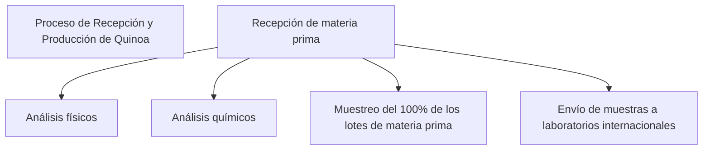

```mermaid
graph TD;
A[Proceso de Recepción y Producción de Quinoa];
B[Recepción de materia prima];
C[Análisis físicos];
D[Análisis químicos];
E[Muestreo del 100% de los lotes de materia prima];
F[Envío de muestras a laboratorios internacionales];

B-->C;
B-->D;
B-->E;
B-->F;


```